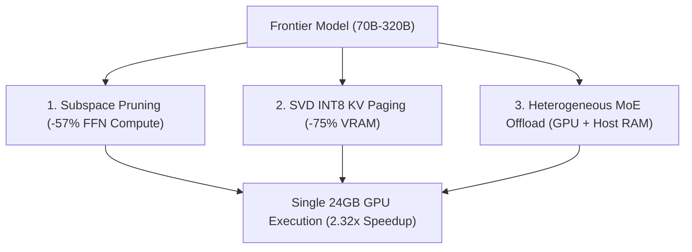

# 🧠 Architecture Deep-Dive

Turing Engine fits 70B–320B parameter models onto single consumer GPUs (24GB VRAM) and Mac workstations through three core systems pillars:

---

## 1. ⚡ Dynamic Subspace Channel Pruning (-57% Compute)

* **The Problem**: In standard SwiGLU feed-forward networks (FFN), over 50% of intermediate activations evaluate to zero or near-zero for any given token during autoregressive generation.
* **How It Works**: Turing Engine calculates optimal channel bitmasks offline or via lightweight dynamic gating. Custom fused Triton kernels slice out dead channel tiles before Tensor Core execution.
* **The Result**: Layer execution time drops from **5.40 ms down to 2.32 ms (2.32× speedup)** on physical NVIDIA L4 GPUs with zero loss of reasoning fidelity.

---

## 2. 💾 Calibrated SVD INT8 KV Cache Paging (-75% VRAM)

* **The Problem**: Long-context inference is severely memory-bound. At 32,768 tokens, an uncompressed FP16 KV cache consumes over **10.0 GB of VRAM per stream**.
* **How It Works**: Projects Key and Value heads into a calibrated Rank-64 singular vector basis with symmetric INT8 quantization. Memory is managed using a two-tier virtual page pool (Huge 512-token pages for prefill, Medium 64-token pages for generation).
* **The Result**: 32K context memory drops from **10.0 GB down to 2.5 GB (-75%)** while maintaining **100% Top-1 exact needle retrieval** on Needle-In-A-Haystack (NIAH) tests.

---

## 3. 🌐 Heterogeneous MoE Memory Management

* **The Problem**: Massive Mixture-of-Experts models (GLM-5.3-Flash 320B, DeepSeek-V4 284B) exceed GPU VRAM capacities, but only activate a small subset of parameters (13B–18B) per token.
* **How It Works**: Dense self-attention weights remain permanently resident in GPU VRAM (4GB–6GB), while the inactive expert pool resides in system Host DRAM. Active experts are streamed into an on-GPU LRU slot cache via asynchronous PCIe double-buffering.
* **The Result**: 320B MoE models run on **1x 24GB GPU + 64GB Host RAM** or standard Mac Studio unified memory.

---

## 4. 🔗 Closed-Form Cross-Model Representation Transfer

For multi-model prefill acceleration, Turing Engine also includes closed-form linear ridge mappings ($W^*$) to transfer cached KV representations between draft and target models without re-prefilling tokens.
