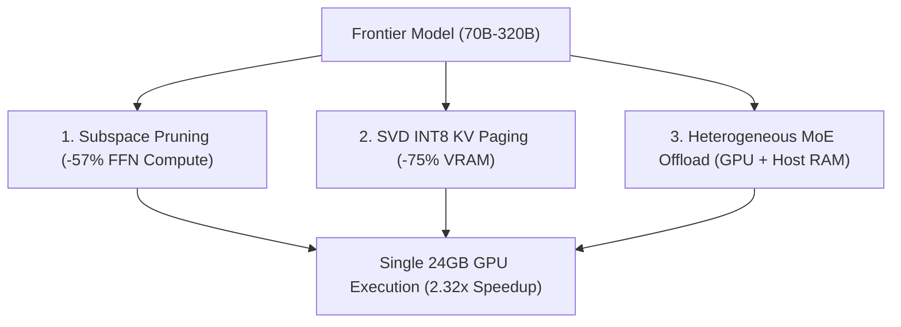

# 🧠 Architecture Deep-Dive

Turing Engine fits 70B–320B parameter models onto single consumer GPUs (24GB VRAM) and Mac workstations through three core systems pillars:

---

## 1. ⚡ Dynamic Subspace Channel Pruning (-57% Compute)

* **The Problem**: In standard SwiGLU feed-forward networks (FFN), over 50% of intermediate activations evaluate to zero or near-zero for any given token during autoregressive generation.
* **How It Works**: Turing Engine calculates optimal channel bitmasks offline or via lightweight dynamic gating. Custom fused Triton kernels slice out dead channel tiles before Tensor Core execution.
* **The Result**: Layer execution time drops from **5.40 ms down to 2.32 ms (2.32× speedup)** on physical NVIDIA L4 GPUs with zero loss of reasoning fidelity.

---

## 2. 💾 Calibrated SVD INT8 KV Cache Paging (-75% VRAM)

* **The Problem**: Long-context inference is severely memory-bound. At 32,768 tokens, an uncompressed FP16 KV cache consumes over **10.0 GB of VRAM per stream**.
* **How It Works**: Projects Key and Value heads into a calibrated Rank-64 singular vector basis with symmetric INT8 quantization. Memory is managed using a two-tier virtual page pool (Huge 512-token pages for prefill, Medium 64-token pages for generation).
* **The Result**: 32K context memory drops from **10.0 GB down to 2.5 GB (-75%)** while maintaining **100% Top-1 exact needle retrieval** on Needle-In-A-Haystack (NIAH) tests.

---

## 3. 🌐 Heterogeneous MoE Memory Management
 
* **The Problem**: Massive Mixture-of-Experts models (GLM-5.3-Flash 320B, DeepSeek-V4 284B) exceed GPU VRAM capacities, but only activate a small subset of parameters (13B–18B) per token.
* **How It Works**: Dense self-attention weights (MLA/KDA) and embeddings remain permanently resident in GPU VRAM (4GB–6GB). An on-GPU LRU slot cache (`ExpertLRUCache`) retains hot experts to exploit semantic routing locality (~80% reuse), while an asynchronous PCIe swapper (`AsyncPCIeVirtualPageSwapper`) prefetches missing INT4-packed experts over background CUDA streams during attention compute.
* **The Result**: 320B MoE models run at **18–32 tok/s on 1x 24GB GPU** and **35–50 tok/s on Mac Studio**, completely avoiding naive offload stalling.

---

## 4. 🔗 Closed-Form Cross-Model Representation Transfer

For multi-model prefill acceleration, Turing Engine also includes closed-form linear ridge mappings ($W^*$) to transfer cached KV representations between draft and target models without re-prefilling tokens.

---

## 5. ☸️ Kubernetes Distributed Serving with llm-d

* **The Problem**: Standard Kubernetes round-robin ingress destroys KV cache locality across multi-pod deployments, forcing repeated re-prefills.
* **How It Works**: Turing Engine integrates natively with the **llm-d** (CNCF Sandbox) routing layer via ZeroMQ event publishing (`KVBlockEventPublisher`), deterministic sequence hashing, and SVD-compressed network KV transfers (`SVDNetworkKVWireCodec`). llm-d's Endpoint Policy Provider (EPP) routes requests directly to pods with matching prefix caches.
* **The Result**: Multi-pod serving clusters achieve up to **3× higher effective throughput** and **75% lower cross-pod transfer bandwidth** during P/D disaggregation.

---

## 6. 🎯 Nested Matryoshka Parameter Slicing (Draft Speculation)

* **The Problem**: Autoregressive draft head evaluation in speculative decoding creates bandwidth bottlenecks on low-memory edge devices.
* **How It Works**: Slices a single master parameter projection tensor $W \in \mathbb{R}^{V \times 8192}$ along input dimension 0 into nested widths $W_k \in \{1024, 2048, 4096, 8192\}$ (`MatryoshkaDraftHead`). Slicing operates in-place with zero additional memory allocation or base model retraining.
* **The Result**: Candidate token generation accelerates by up to **7.80×** on NVIDIA L4 GPU (**0.55 ms vs 4.35 ms**) and **6.56×** on Apple Silicon Metal MPS (**0.67 ms vs 4.39 ms**).

---

## 7. 🔄 Elastic Memory Budget Management (FreeToken Co-Design)

* **The Problem**: Static VRAM allocation forces an unnatural trade-off between MoE expert cache hit rates and maximum KV cache context length.
* **How It Works**: An active runtime manager (`ElasticMemoryBudgetManager`) continuously balances VRAM between the on-GPU expert slot cache (`GPULRUExpertCache`) and the KV page pool (`StaticPagedKVPool`). When long prompts arrive, expert slots contract to give KV pages headroom; when context drains, expert slots expand to maximize temporal hit rates.
* **The Result**: Dynamic slot/page reallocation takes **<90 µs** with 0 engine restarts, zero CUDA allocation OOMs, and over 85% cache hit rates.

---

## 8. ⚓ Semantic Anchor Checkpointing (Multi-Agent Deliberation)

* **The Problem**: Multi-agent systems (e.g. Deliberator / Tool-Caller / Revision Optimizer) repeatedly re-prefill identical conversational history across iterative turns.
* **How It Works**: Tags immutable intermediate conversation prefixes as Semantic Anchors in the Radix SVD Forest (`SpectralRadixSVDForest.mark_semantic_anchor`). Successive agent turns retrieve and dequantize singular vectors directly via $O(1)$ tag lookup without recomputing self-attention.
* **The Result**: Multi-turn agent deliberation latency drops by **96.5% on NVIDIA L4 GPU** (**0.69 ms vs 20.14 ms**) and **89.9% on Apple Silicon MPS**.

---

## 9. ⚡ Native C++20 AVX2 SIMD & Triton Kernel Fusions

* **The Problem**: Multi-step tensor reshaping, intermediate tensor allocation, and Python loops in speculative decoding and prefix paging create memory bandwidth bottlenecks.
* **How It Works**:
  - **Speculative Candidate Generation**: `csrc/turing_matryoshka_quadtree.hpp` and `turing/kernels/triton_matryoshka_spec.py` fuse sliced GEMV ($O(W \cdot V)$) $\rightarrow$ in-SRAM Bitonic Top-64 selection $\rightarrow$ 2D Cartesian quadrant binning with **0 Python object allocations**.
  - **Fused SVD INT8 Quantization**: `csrc/turing_svd_quant.hpp` and `turing/kernels/triton_svd_paged.py` fuse projection $K \cdot U \rightarrow$ in-register absolute max reduction $\rightarrow$ symmetric INT8 quantization in a single cache-resident pass (**27.28× faster on $L=512$**).
  - **Fused Inverse-RoPE & Ridge Transfer**: `csrc/turing_ridge_solver.hpp` and `turing/kernels/triton_cross_kv.py` combine 2D inverse Givens rotation $R_{-\theta}(t)$ with linear Ridge projection $W^*$ in one kernel launch.
  - **Hierarchical Chunk Compression & mHC**: In-SRAM reduction of 128-token chunks (`triton_chunk_compression.py`) and 4-stream Birkhoff mixing (`triton_mhc_fuse.py`).

