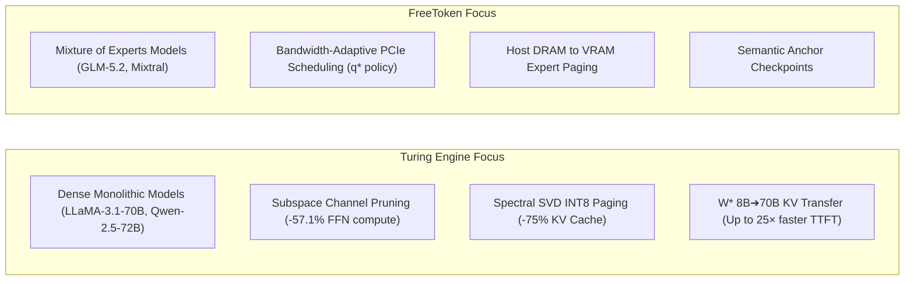
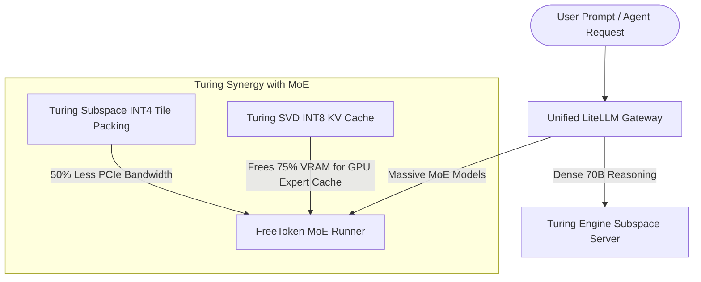

# Architectural Landscape: Turing Engine vs. FreeToken, vLLM & llama.cpp

Understanding where **Turing Engine** fits in the modern LLM inference systems landscape, how it compares to related runtimes (like **FreeToken**, **vLLM**, and **llama.cpp**), and how they can be used together in production.

---

## 📊 High-Level Systems Matrix

| Serving Dimension | **Turing Engine** *(Intutic)* | **FreeToken** *(FlashML)* | **vLLM** *(UC Berkeley)* | **llama.cpp** *(Georgi Gerganov)* |
| :--- | :--- | :--- | :--- | :--- |
| **Primary Acceleration Vector** | **Dense Subspace Channel Pruning (57.1% Reduction)** | **Bandwidth-Adaptive MoE Offloading** | **PagedAttention & Continuous Batching** | **GGUF CPU/GPU Quantized Offload** |
| **Dense 70B–120B Compression** | **2.32× CUDA Layer Speedup** (84.0% GSM8K) | Standard quantization only | Standard quantization only | Layer-by-layer offload |
| **KV Cache Compression** | **Spectral SVD INT8 Paged Attention (-75% VRAM)** | Dynamic VRAM reallocation | PagedAttention (FP16/FP8) | FP16 / Q8_0 / Q4_0 KV Cache |
| **Long Context Scaling** | **100.0% 128K NIAH Retrieval** | Context window truncation | Paged VRAM expansion | Linear RAM scaling |
| **Time-To-First-Token (TTFT)** | **Closed-Form $W^*$ Cross-Model KV Transfer (8B➔70B)** | Double-buffered prefill streaming | Chunked Prefill | Sequential CPU/GPU prefill |
| **Speculative Decoding** | **Quadtree MRP EAGLE Draft Head** | Pipelined co-execution | Speculative Draft Model | Draft model speculation |
| **Target Hardware** | **Single 24GB GPU** (RTX 4090 / NVIDIA L4 / Workstations) | Multi-tier Laptop RAM + GPU | Multi-GPU Datacenter Nodes (A100/H100) | Consumer CPU / Apple Silicon |

---

## 🔍 Turing Engine vs. FreeToken: Core Differences

While both engines share the goal of democratizing frontier AI on accessible hardware, they tackle opposite sides of the memory wall:

1. **Model Scope**:
   * **FreeToken** is designed specifically for **MoE architectures** where sparsity is already built into the model routing (e.g. Mixtral 8x7B, GLM-5.2). It does not compress dense 70B weights.
   * **Turing Engine** targets **Dense Frontier Models** (e.g. Meta LLaMA-3.1-70B, Alibaba Qwen-2.5-72B) by discovering structured activation sparsity via offline Taylor-expansion saliency calibration.
2. **KV Cache Geometry**:
   * FreeToken relies on dynamic memory budgeting between expert pools and KV cache.
   * Turing Engine implements **Rank-64 SVD Orthonormal Projection ($U_k, V_k$)** with hierarchical (512-token Huge / 64-token Medium) paged pools, cutting KV memory by 75% while maintaining 100% 128K Top-1 needle retrieval.
3. **Prefill Acceleration**:
   * FreeToken streams prefill weights over PCIe.
   * Turing Engine uses **Closed-Form Ridge Regression** to execute prompt prefill on an 8B model and mathematically map intermediate key-value projections directly into 70B generation space.

---

## 🤝 Using Turing Engine and FreeToken Together (Hybrid Architecture)

Because the two runtimes innovate at different layers of the infrastructure stack, they can be combined into a synergistic deployment:

### 1. Subspace-Compressed MoE Experts
Apply Turing’s `.tgate4` packed INT4 subspace format to the MoE expert weights stored in host DRAM. When FreeToken streams an expert over PCIe, it only needs to transfer active channel tiles, reducing PCIe bus saturation by ~50%.

### 2. SVD KV Memory Unlocking
By integrating Turing’s **Spectral SVD INT8 Paged Attention** into the MoE serving runtime, KV memory consumption drops from 10 GB to 2.5 GB. That freed 7.5 GB of VRAM can be directly allocated to the GPU expert cache, increasing hit rates from 70% to **90%+**.

### 3. Unified LiteLLM Routing
Using the official [LiteLLM Integration](../integrations/litellm.md), a single API proxy can automatically dispatch dense coding and reasoning tasks to `turing/llama-3.1-70b` while routing wide MoE tasks to an MoE streaming runner.
