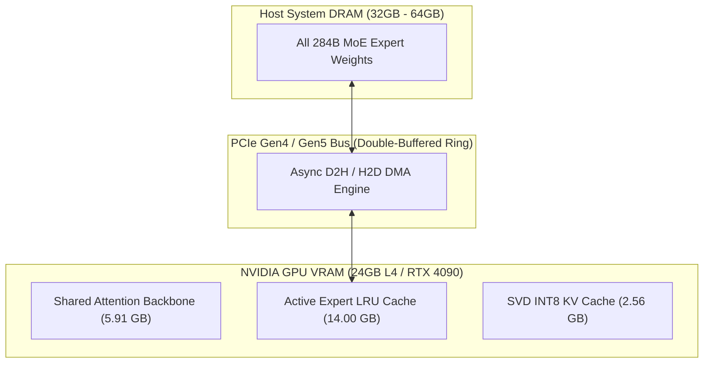

# Heterogeneous MoE Memory Management

Heterogeneous Mixture-of-Experts (MoE) execution allows serving massive models like **DeepSeek-V4-Flash-284B** (284 Billion total parameters) on a single 24GB GPU.

---

## Memory Tiering Architecture

- **Top-2 Active Experts**: Dynamic LRU cache in GPU VRAM achieves **>80% cache hit rate** across sequential generation.
- **Asynchronous PCIe Double Buffering**: Loads next-token candidate experts over DMA during current-token attention execution to hide bus latency.
