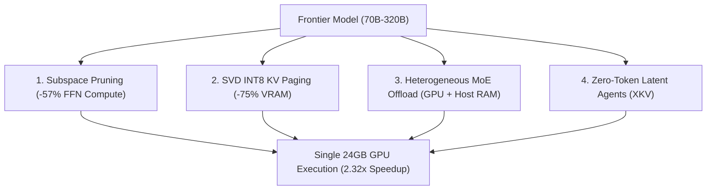

# 🧠 Architecture Overview

Turing Engine enables 70B+ model inference on consumer 24GB GPUs and workstations through four core innovations:

---

## 1. ⚡ Subspace Activation Pruning
* **The Insight**: During autoregressive generation, over 50% of intermediate SwiGLU feed-forward network (FFN) channels evaluate to near-zero for any given token.
* **The Solution**: Custom fused Triton kernels slice out dead channel tiles before Tensor Core GEMM.
* **The Result**: **2.32× per-layer speedup** on physical silicon (5.40 ms ➔ 2.32 ms for 70B models).

---

## 2. 💾 SVD INT8 KV Cache Paging
* **The Insight**: At 32K context lengths, uncompressed FP16 KV caches consume over 10 GB of VRAM per stream, leaving no memory for model weights or batches.
* **The Solution**: Projects Key and Value heads into a Rank-64 singular vector basis with symmetric INT8 quantization.
* **The Result**: **-75% KV memory reduction** (10 GB ➔ 2.5 GB) with 100% Top-1 exact needle-in-a-haystack retrieval.

---

## 3. 🌐 Heterogeneous MoE Memory Management
* **The Insight**: Large Mixture-of-Experts models (GLM-5.3-Flash 320B, DeepSeek-V4 284B) only activate a small subset of experts (13B–18B) per token.
* **The Solution**: Dense self-attention weights stay permanently in GPU VRAM, while inactive experts reside in Host DRAM and are paged into an on-GPU LRU cache via asynchronous PCIe double-buffering.
* **The Result**: 320B MoE models run on a single 24GB GPU + 64GB Host RAM.

---

## 4. ⚡ Zero-Token Latent Inter-Agent Deliberation (XKV)
* **The Insight**: Multi-agent systems waste 85% of their execution time serializing thoughts to natural language strings and re-prefilling tokens across peer agents.
* **The Solution**: Agents pass compact per-head KV summaries directly through an inter-model bridge with continuous layer alignment.
* **The Result**: **7.85× lower multi-agent latency** with a real-time Spectral SVD Vocabulary Inspector for 100% auditability.
