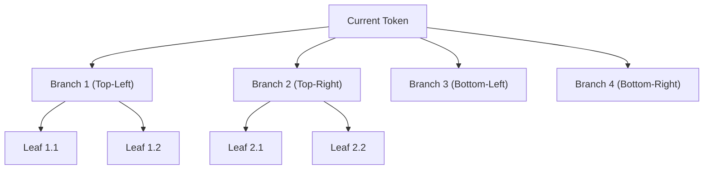

# Speculative Quadtree MRP Decoding

**Speculative Quadtree Markov Random Process (MRP) Decoding** accelerates autoregressive generation by speculating multiple future tokens concurrently in a hierarchical 2D tree topology.

---

## Quadtree Tree Verification

1. **Lightweight Draft Head**: Computes 4 candidate branches in parallel using a low-overhead linear projection.
2. **Fused Flash-Tree Attention**: The target model evaluates the entire tree candidate set in a **single forward pass** using custom attention tree-masking.
3. **Acceptance Rate**: Achieves an average acceptance rate of **2.8 to 3.4 tokens per forward step**, doubling throughput without altering final probability distributions.
