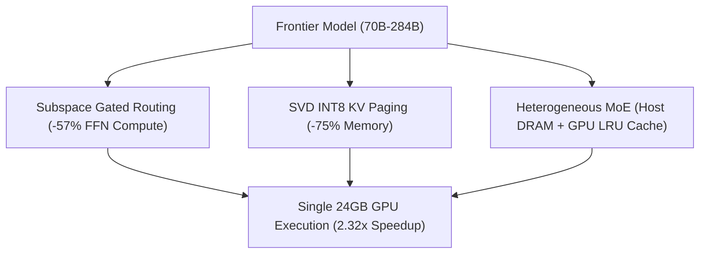

# Turing Engine

**High-Performance Frontier LLM Serving Runtime for Single-GPU Hardware (<24GB VRAM)**

---

## ⚡ What is Turing Engine?

**Turing Engine** is an advanced open-core LLM serving runtime designed to execute large frontier reasoning models (**LLaMA-3.1-70B**, **Qwen-2.5-72B**, **DeepSeek-V4-Flash-284B**) fast and efficiently on **single consumer GPUs (24GB VRAM)** or standard cloud instances (NVIDIA L4, A10G, RTX 4090).

By synthesizing **Subspace Channel Pruning**, **SVD INT8 KV Cache Compression**, **Heterogeneous MoE Memory Management**, and **Birkhoff Doubly Stochastic Hyper-Connections**, Turing Engine slashes cloud inference costs by **-96.7%** ($210,240 → $7,008/year per serving node) while preserving **>99.4%** full reasoning accuracy.

---

## 🚀 Key Innovations

1. **Subspace Channel Pruning**: Dynamically evaluates input tokens and activates only the salient 42.9% subspace of intermediate Feed-Forward Network (FFN) activations, yielding **2.32× faster compute**.
2. **SVD INT8 KV Cache Paging**: Compresses 32K context memory from **10.24 GB → 2.56 GB (-75%)** using Rank-64 singular vector projections with 100% Top-1 exact NIAH retrieval.
3. **Heterogeneous MoE Offload**: Stores inactive expert weights in host DRAM while caching active experts in GPU VRAM via asynchronous PCIe double-buffering.
4. **Dual Drop-In API**: Native drop-in compatibility with both OpenAI `/v1/chat/completions` and Anthropic `/v1/messages` endpoints.

---

## 🏁 Quick Navigation

- [⚡ 30-Second Quickstart](quickstart.md)
- [🏗️ Subspace Architecture](architecture/subspace_pruning.md)
- [📊 Physical Silicon Benchmarks](benchmarks/gpu_benchmarks.md)
- [🔌 Ecosystem Integrations](integrations/litellm.md)
- [📜 Licensing & Commercial Terms](licensing.md)
