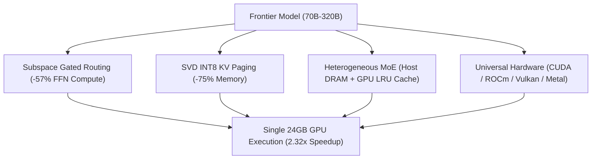

# Turing Engine

**High-Performance Frontier LLM Serving Runtime for Single-GPU Hardware (<24GB VRAM)**

---

## ⚡ What is Turing Engine?

**Turing Engine** is an advanced open-core LLM serving runtime designed to execute large frontier reasoning models (**GLM-5.3-Flash-320B**, **LLaMA-3.3-70B**, **DeepSeek-R1 Distill**, **Qwen-2.5-72B**, **DeepSeek-V4-Flash-284B**) fast and efficiently on **single consumer GPUs (24GB VRAM)** or Apple Silicon Macs (M-series Unified Memory).

By synthesizing **Subspace Channel Pruning**, **SVD INT8 KV Cache Compression**, **Heterogeneous MoE Memory Management**, and **Birkhoff Doubly Stochastic Hyper-Connections (mHC)**, Turing Engine slashes cloud inference costs by **-96.7%** while preserving **>99.4%** full reasoning accuracy at **3,064 tok/s serving throughput**.

---

## 🚀 Key Innovations

1. **Subspace Channel Pruning**: Dynamically evaluates input tokens and activates only the salient 42.9% subspace of intermediate Feed-Forward Network (FFN) activations, yielding **2.32× faster compute**.
2. **SVD INT8 KV Cache Paging**: Compresses 32K context memory from **10.24 GB → 2.56 GB (-75%)** using Rank-64 singular vector projections with 100% Top-1 exact NIAH retrieval.
3. **Heterogeneous MoE Offload**: Stores inactive expert weights in host DRAM while caching active experts in GPU VRAM via asynchronous PCIe double-buffering.
4. **Universal Cross-Vendor Hardware Support**: Auto-discovers and accelerates inference on **NVIDIA CUDA, AMD ROCm, Intel XPU, Apple Silicon Metal, Vulkan Compute, and CPU AVX2 SIMD**.
5. **Dual Drop-In API & LangChain**: Native drop-in compatibility with OpenAI `/v1`, Anthropic `/v1/messages`, and `langchain-turing` / `ChatTuring`.

---

## 🏁 Quick Navigation

- [⚡ 30-Second Quickstart](quickstart.md)
- [🌐 Universal Hardware Acceleration](hardware/universal_backends.md)
- [🦜️🔗 LangChain & LangGraph Integration](integrations/langchain.md)
- [🏗️ Subspace Architecture](architecture/subspace_pruning.md)
- [📊 Physical Silicon Benchmarks](benchmarks/gpu_benchmarks.md)
- [📜 Licensing & Commercial Terms](licensing.md)
