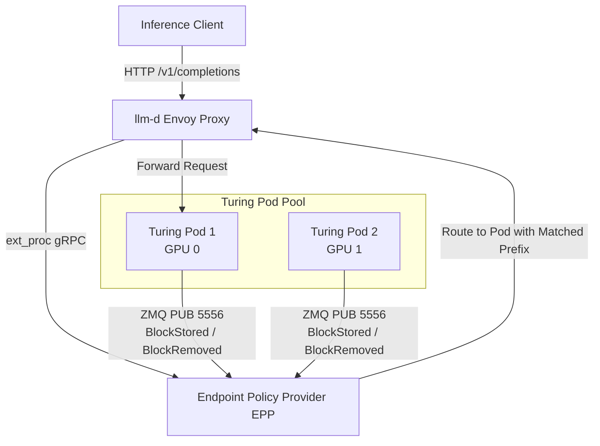

# Kubernetes Distributed Serving with llm-d

This guide explains how to deploy **Turing Engine** in a **Kubernetes** cluster orchestrated by **llm-d** (CNCF Sandbox) for **precise prefix-cache aware routing**, **P/D disaggregation**, and **high-density multi-pod inference**.

---

## 🎯 Architecture Overview



### How Prefix-Cache Aware Routing Works
1. **Real-Time KV Event Stream**: Each Turing Engine pod runs a background `KVBlockEventPublisher` emitting `BlockStored` and `BlockRemoved` events over ZeroMQ (port 5556) whenever prompt prefixes are inserted or evicted from the `SpectralRadixSVDForest`.
2. **Deterministic Block Hashing**: Block hashes are calculated using deterministic 64-bit hashing across sequence chunks, guaranteed across all replicas.
3. **EPP Cache Index**: The llm-d `precise-prefix-cache-producer` indexes active KV blocks per pod. When a new request arrives, llm-d routes it to the replica that already holds the maximum matching prefix tokens, skipping re-computation.
4. **SVD-Compressed Wire Transfer**: In distributed and disaggregated topologies, Turing Engine transfers KV cache blocks using Rank-64 Subspace INT8 projection via `SVDNetworkKVWireCodec`, reducing network bandwidth by **~75%**.

---

## 🚀 Deployment Guide

### Prerequisites
- Kubernetes cluster v1.28+ with NVIDIA GPU nodes (e.g. Google Cloud GKE with NVIDIA L4 or A100 GPUs)
- Gateway API Inference Extension (GAIE) v1 CRDs installed:
  ```bash
  kubectl apply -f https://github.com/kubernetes-sigs/gateway-api-inference-extension/releases/latest/download/manifests.yaml
  ```
- Helm 3.12+

### Step 1: Install the llm-d Router

```bash
helm install llm-d-router oci://ghcr.io/llm-d/charts/llm-d-router-standalone \
  --namespace llm-d-serving \
  --create-namespace
```

### Step 2: Deploy Turing Engine via Helm

Deploy Turing Engine with `llmd.enabled=true`:

```bash
helm install turing-llama deploy/helm/turing-serving/ \
  --namespace llm-d-serving \
  --set llmd.enabled=true \
  --set llmd.guide=optimized-baseline \
  --set llmd.engineType=turing \
  --set model.name="meta-llama/Llama-3.1-70B-Instruct" \
  --set model.device="cuda" \
  --set replicaCount=2
```

### Step 3: Register the InferencePool

Apply the `InferencePool` to bind the llm-d router to Turing Engine pods:

```yaml
apiVersion: inference.networking.k8s.io/v1
kind: InferencePool
metadata:
  name: turing-pool
  namespace: llm-d-serving
spec:
  selector:
    matchLabels:
      llm-d.ai/engine-type: "turing"
  targetPorts:
    - 8000
  appProtocol: http
  endpointPickerRef:
    name: llm-d-router-epp
    port: 9002
    failureMode: FailOpen
```

Apply the manifest:
```bash
kubectl apply -f deploy/llmd/inferencepool.yaml -n llm-d-serving
```

---

## 📈 Monitoring & Telemetry

Turing Engine exports Prometheus metrics on `GET /metrics` matching llm-d EPP scorer requirements:

```
# HELP turing_num_requests_waiting Number of requests queued in waiting backlog (llm-d TotalQueuedRequests)
# TYPE turing_num_requests_waiting gauge
turing_num_requests_waiting 0

# HELP turing_num_requests_running Number of requests currently executing in batch (llm-d TotalRunningRequests)
# TYPE turing_num_requests_running gauge
turing_num_requests_running 1

# HELP turing_kv_cache_usage_perc Fraction of KV cache memory pool in use (llm-d KVCacheUtilization)
# TYPE turing_kv_cache_usage_perc gauge
turing_kv_cache_usage_perc 0.125

# HELP turing_cache_config_info KV cache configuration info (llm-d BlockSize and NumGPUBlocks)
# TYPE turing_cache_config_info gauge
turing_cache_config_info{block_size="64",num_gpu_blocks="1024"} 1.0
```

---

## 🔧 Token Render Endpoint for EPP

llm-d's `token-producer` data plugin calls `/v1/completions/render` or `/v1/chat/completions/render` to extract token IDs for exact prefix cache indexing:

```bash
curl -X POST http://localhost:8000/v1/completions/render \
  -H "Content-Type: application/json" \
  -d '{"prompt": "Hello world!"}'
```

Response:
```json
{
  "tokens": [15496, 995, 0],
  "count": 3
}
```
